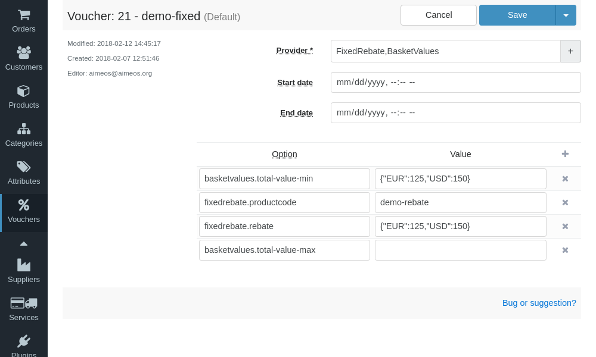

There are some select and input fields in the left section of the detail view that are available for configuring a coupon. Their purpose are:

Status (required)
: Controls the global availability of the configured coupon. There are several status values available but the coupon will only be used if the status is "enabled".

Label (required)
: An internal label which helps you to identify the coupon and which can be used for searching in the administration interface.

Provider (required)
: This is the last part of the coupon provider class name, e.g. "FixedRebate" for the "\Aimeos\MShop\Coupon\Provider\FixedRebate". The name of the provider is **case sensitive**, so "fixedrebate" is not the same as "FixedRebate"! You will get a list of available providers when clicking on the input field. Each coupon provider can be enhanced by one or more decorators that must be added to the provider name and separated by a comma. You view the list of available decorators when clicking on the "+" symbol right of the input field. By clicking on the decorator name it will be added after the provider name or previously added decorators. For a detailed description of the available coupon providers and decorators that are part of the Aimeos core, please have a look at the [coupon overview](coupons.md) and the page for the [coupon decorators](coupon-decorators.md).

Start date (optional)
: The point in time when the coupon will be available for customers to enter their codes. The date/time has to be in ISO format (YYYY-MM-DD HH:mm:ss) and the hours must be in the range of 0-23.

End date (optional)
: The point in time when the coupon won't be available any more. For this field the same format applies as for "Start date".


# Coupon configuration

The right side (or below) of the coupon detail view contains a key/value configuration panel where the necessary configuration values of the coupon and the decorators must be added. The left column in the configuration panel is for the configuration key, the right column for the value and at least the left column of each line must be filled with a valid key. You can add lines by clicking on the "Add" button in the menu bar and delete selected lines with the "Delete" button. The order of the lines doesn't matter.



Each coupon and decorator needs its own configuration. For details about the required resp. available configuration keys and values, please refer to the documentation of the coupon or decorator. Documentation for the built-in ones is available at the [coupon overview](coupons.md) page and the [coupon decorators](coupon-decorators.md) page. When you add a provider or a decorator, their configuration options will be added to the list automatically.

# Coupon codes

You can add new coupons by clicking on the "+" symbol in the upper right corner of the list header and click on "Add" in the dropdown menu. Alternatively, you can import a whole file of coupon codes, one at each line by choosing "Import" instead. Also, this file can contain the number of times the code is valid as well as its start and end date separated by commas in each line.


There available fields for coupon codes are:

Code (required)
: A coupon code that is unique in the shop site and is able to identify only the coupon configuration its associated with. Good coupon codes are not two long and should avoid similar looking characters (e.g. zero and "O" or 1 and "l"). Please think twice before you really add codes with more than eight characters! If a code should be generally available, it's a good idea to create a descriptive code for your promotion. In the other case, if a lot of codes are generated and each code is exactly for one user, they must be random enough so they can't be guessed.

Count (optional)
: The number of times the code can be redeemed. This can be "1" if only one customer should be able to do so or any other positive number. A value of zero disables the coupon code und no value means that the code is available an unlimited number of times.

Start date (optional)
: The point in time when this coupon code can be entered by the customer. The date/time has to be in ISO format (YYYY-MM-DD HH:mm:ss) and the hours must be in the range of 0-23.

End date (optional)
: The point in time when the coupon code will expire. For this field the same format applies as for "Start date".

## CSV upload

There's also the possibility to upload CSV files with coupon codes when clicking on the the "+" symbol in the upper right corner of the coupon code list.


The format of the uploaded file must be:

```
Code;Count;Start date;End date
TEST1,1,2020-01-01 00:00.00,2020-12-31 23:59:59
TEST2,1
TEST3
```

The values for count, start date and end date are optional and using to value means no limitation of the coupon code in terms of the number of times it can be redeemed and time it is valid within.

!!! note
    To import the uploaded file, the "Coupon code import CSV" (*coupon/import/csv/code*) job must be executed regularly by a cronjob.
