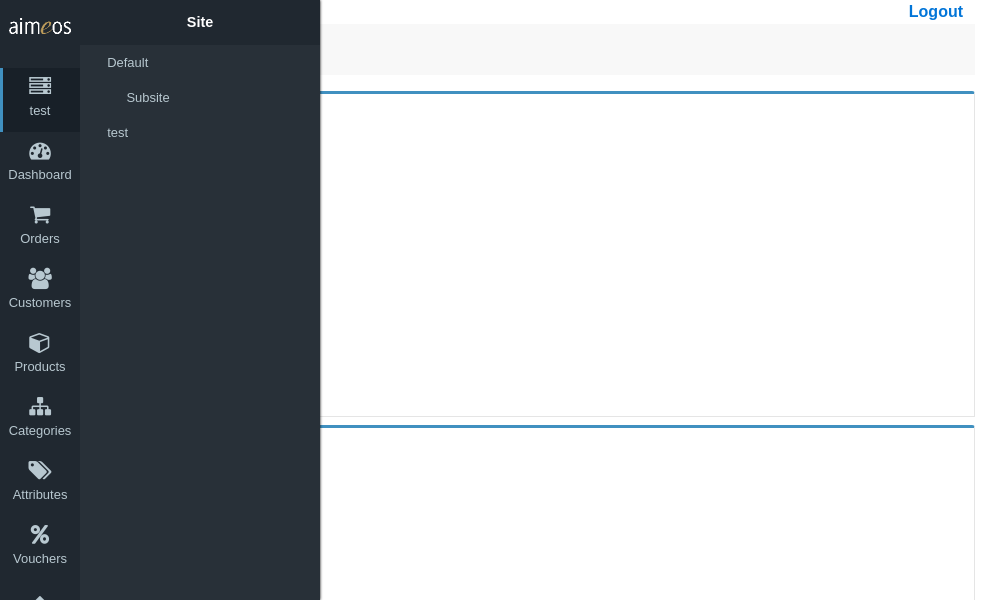

# Working with sites

## What is a "site"

Aimeos is capable of handling multiple shops by one installation and each shop is called a "site" in Aimeos' terminology. The basic version of Aimeos provides a single site called "Default" after installation, which should be the base of your first shop. This shop instance will contain all products with all associated data you are going to set up, the configuration of the delivery and payment as well as the orders that will be created by your customers.

## Adding more sites

If you want to set up more shops, you are able to create an unlimited number of top-level shop instances, which are independent from each other. The easiest way is to run the setup/update script and passing a new site code. This will create a new site with all required data including the necessary default data like the types.

Furthermore, the [Aimeos company](https://aimeos.com/extensions/) offers an extension, which enables you to add sub-shops that inherit products, categories, pictures, texts, etc. from parent sites. You can even add more sites to these sub-shops without any restrictions in depth. This is perfect for market places, reseller structures and complex B2B portals.

## Change site in backend

For switching between the different available sites, the administration interface contains a site selector in the upper left corner. The icon is only shown, if there's more than one site you have access to with your user. Super users will see all sites, admin users only their own ones and editors can't switch between sites.

Depending on the selected site, you will see the data associated with this site. If the ai-sites extension of the Aimeos company is installed, data inherited from parent sites is shown as well, but can't be changed, only enriched.

