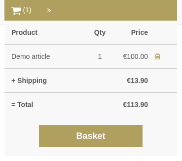
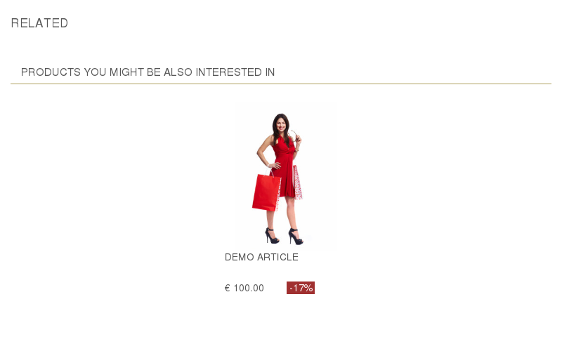

There are at least two different basket implementations available: The big standard basket and a small mini basket that provides a short summary about what is currently in the basket of the customer. Furthermore, a "related" component is available to display content that's related to the content of the current basket of the customer, e.g. what other customers also bought.

A configuration option that is shared between all basket implementations:

[client/html/basket/cache/enable](../../config/client-html/basket-cache.md#enable)
: Controls caching of the basket in the session of the customer

# Standard

The standard basket implementation is the main shopping cart the customers are interacting with. It offers the complete functionality for adding, editing, and deleting products and coupon codes. The underlying data is stored in the current session of the customer.

## Structure


There's only the main component without subparts by default but you can add your own subparts using the [subpart configuration of the basket component](../../config/client-html/basket-standard.md#subparts).

Most of the HTML layout code is located in the shared [common summary partials](https://github.com/aimeos/ai-client-html/tree/master/client/html/templates/common/summary) so you will have to revise it if you want to change the layout.

If you want to change the layout of the basket independently of the checkout summary and the confirmation e-mail, you can use the [client/html/basket/standard/summary/detail](../../config/client-html/basket-standard.md#detail) configuration setting to point to a different partial file.

## Templates

You can add other templates to the basket page by overwriting the templates in your own extension or by configuring alternative template names:

* [basket header template](../../config/client-html/basket-standard.md#template-header)
* [basket body template](../../config/client-html/basket-standard.md#template-body)

Within the basket body template, the [common summary partials](https://github.com/aimeos/ai-client-html/tree/master/client/html/templates/common/summary) shared with other components (checkout, email) are used too. If you want to change the HTML structure of one of the templates, please have a look at the original versions to ensure that you don't lose essential functionality.

## Parameters

To put something into the basket, you must send the required data through a GET or POST request to the page of the standard basket. The format of the parameters depends on the action in "b_action" and the host application can require the parameters to be included into its own parameter array.

Without required host parameter array:

```html
<input type="hidden" name="b_action" value="add" />
```

With host parameter array:

```html
 <input type="hidden" name="ai[b_action]" value="add" />
```

In the later example, all parameters are part of the "ai" array. Applications like CMS use this to distinguish between parameters for different plug-ins on the same page.

### Add products

To add products to the basket, at least the product ID is required. For all other parameters, default values are used if none are passed. Furthermore, more than one product can be added at once to the basket because all parameters related to one product are grouped together by a sequence number. The structure of the input names are:

* `b_prod[<number>][prodid]` (product ID)
* `b_prod[<number>][quantity]` (number of product to add to the basket)
* `b_prod[<number>][attrvarid][<attrcode>]` (Attribute IDs to determine the article of a selection product)
* `b_prod[<number>][attrconfid][]` (Attribute IDs for product options)
* `b_prod[<number>][attrcustid][<attribute ID>]` (Attribute IDs and arbitrary values for custom product attributes)
* `b_prod[<number>][stocktype]` (Warehouse code if several warehouses are available)
* `b_prod[<number>][supplier]` (Code of the supplier the product is is available from)
* `b_prod[<number>][siteid]` (Site ID which should be stored with the product in the basket)

Adding two different products at once would be possible with these HTML input fields:

```html
<input type="hidden" name="b_action" value="add" />
<input type="hidden" name="b_prod[0][prodid]" value="1" />
<input type="hidden" name="b_prod[0][quantity]" value="3" />
<input type="hidden" name="b_prod[0][attrvarid][length]" value="32" />
<input type="hidden" name="b_prod[0][attrvarid][width]" value="34" />
<input type="hidden" name="b_prod[0][attrconfid][id][]" value="12" />
<input type="hidden" name="b_prod[0][attrconfid][qty][]" value="2" />
<input type="hidden" name="b_prod[0][attrconfid][id][]" value="11" />
<input type="hidden" name="b_prod[0][attrconfid][qty][]" value="1" />
<input type="hidden" name="b_prod[0][attrcustid][40]" value="some text" />
<input type="hidden" name="b_prod[0][attrcustid][41]" value="2000-01-01" />
<input type="hidden" name="b_prod[0][stocktype]" value="berlin" />
<input type="hidden" name="b_prod[0][supplier]" value="mybrand" />
<input type="hidden" name="b_prod[0][siteid]" value="1." />
<input type="hidden" name="b_prod[1][prodid]" value="2" />
```

The first product (ID 1) is added three times with two variant IDs specifying the article of the selection product (32 and 34), two attribute IDs for configurable product parts (12 and 11), two attributes that are added to the ordered product without showing up in the basket (23 and 24) as well as two custom attributes (40 and 41) with arbitrary values. The second product (ID 2) has no attributes at all and is only added once to the basket.

### Delete products

For deleting products, only their position in the basket is required which must be passed via the "b_position" parameter. You can also delete several products from the basket at once by using an array of values:

* `b_position[<number>][]` (product position in the basket)

Deleting two products from the basket can be done by this HTML snippet:

```html
<input type="hidden" name="b_action" value="delete" />
<input type="hidden" name="b_position[]" value="0" />
<input type="hidden" name="b_position[]" value="1" />
```

!!! warning
    The position of the products in the basket is printed in the output of the basket standard component and you can't rely on that the numbering is always starting from zero!

### Edit products

You can also edit products in the basket, change their quantity and remove configurable product attributes. For this you have to know the position of the product in the basket just like for deleting products. The structure of the parameters is similar to the one for adding products to the basket:

* `b_prod[<number>][position]` (product position in the basket)
* `b_prod[<number>][quantity]` (new quantity of the product)

Editing two products in the basket would be done by this HTML snippet:

```html
<input type="hidden" name="b_action" value="edit" />
<input type="hidden" name="b_prod[0][position]" value="0" />
<input type="hidden" name="b_prod[0][quantity]" value="2" />
<input type="hidden" name="b_prod[1][position]" value="1" />
<input type="hidden" name="b_prod[1][quantity]" value="5" />
```

The quantity of the first product in the basket would be reduced to two and both configurable product attributes would be removed. For the second product, the quantity would be increased to two items.

!!! warning
    The position of the products in the basket is printed in the output of the basket standard component and you can't rely on that the numbering is always starting from zero!

### Manage coupons

Managing coupon codes in the basket is the easiest part as you can only add or delete one coupon code at a time. To add a coupon code use:

```html
<input type="hidden" name="b_action" value="coupon-add" />
<input type="hidden" name="b_coupon" value="TESTCODE" />
```

and to delete it from the basket again use:

```html
<input type="hidden" name="b_action" value="coupon-delete" />
<input type="hidden" name="b_coupon" value="TESTCODE" />
```

Depending on the [number of allowed coupon codes](../../config/controller-frontend/basket.md#couponallowed) in the basket, you can add more than one code but only one at a time.

## Location

Other components need to link to the page which contains the basket or post data to modify the basket content. In order to offer the maximum possible flexibility, there are some configuration options available to specify the exact location of the basket inside the application:

[target](../../config/client-html/basket-standard.md#target)
: Page ID or route that points to the page with the basket component

[controller](../../config/client-html/basket-standard.md#controller)
: Name of the basket controller on the page (default: basket)

[action](../../config/client-html/basket-standard.md#action)

: Name of the basket action in the controller (default: index)

[config](../../config/client-html/basket-standard.md#config)
: Associative list of configuration options used when generating the URL

## Coupon

Coupons are personal or shared codes for granting goodies, giving a price reduction or any other possibility that offers customers an additional advantage. The actions behind coupons are implemented by coupon providers in the MShop library, and they can modify the basket content in any way.

Normally, shop owners would like to grant customers only one advantage per order and thus, the number of coupons that can be entered is limited to one by default. But there may be situations where it's applicable to allow more than one coupon code and therefore, the maximum number of coupon codes can be configured via the [controller/frontend/basket/coupon/allowed](../../config/controller-frontend/basket.md#couponallowed) setting.

# Small

The small basket implementation is the one that can be shown on every page. It displays the main details (usually the number of articles and the total price) of the basket which is stored in the current session of the customer.

## Structure



By default, no subpart is included in the small basket component but you can add your own via its [subpart configuration](../../config/client-html/basket-mini.md#subparts). This component renders the most important basket information (the number of articles and maybe the total price) and will show the basket details in a drop-down when clicked.

## Templates

You can adapt the templates for the small basket component itself by overwriting the existing templates in your own extension or configuring alternative template names:

* [basket header template](../../config/client-html/basket-mini.md#template-header)
* [basket body template](../../config/client-html/basket-mini.md#template-body)

If you want to change the HTML structure of one of the templates, please have a look at the original versions to ensure that you don't loose essential functionality.

# Related

The "basket related" component enables shop owners to display additional content that is directly related to the content in the basket of the customer. One of the standard cases is to show additional products that have been bought by other customers too to create the possibility to sell more products.

## Structure



Currently, only one subpart is included in the "basket related" component, which can be controlled via its [subpart configuration](../../config/client-html/basket-related.md#subparts). This "bought" subpart displays products that have been bought together with the products added to the basket of the customer. You can extend it by further subparts using the [subparts setting for the "bought" section](../../config/client-html/basket-related.md#subparts).

There's a default implementation for the "bought" section but you are able to replace or extend the existing implementation and configure an alternative class name:

* [Bought section class name](../../config/client-html/basket-related.md#name)

!!! note
    Products that should be suggested in the "bought" section must be calculated according to the orders of previous customers. Aimeos comes with a job controller named "product/bought" that does this for you automatically, but you need to run this job regularly, preferably once a day.

## Templates

You can adapt the templates for the "basket related" component itself and its "bought" section by overwriting the templates in your own extension or configuring alternative template names:

* [related header template](../../config/client-html/basket-related.md#template-header)
* [related body template](../../config/client-html/basket-related.md#template-body)
* [bought body template](../../config/client-html/basket-related.md#template-body)

If you want to change the HTML structure of one of the templates, please have a look at the original versions to ensure that you don't loose essential functionality.

## Bought together

Some additional settings for the cross-selling subpart have been implemented to create a configurable implementation that can be adapted to the various needs of shop owners:

[client/html/basket/related/bought/domains](../../config/client-html/basket-related.md#standarddomains)
: List of content types fetched from the database

[client/html/basket/related/bought/limit](../../config/client-html/basket-related.md#standardlimit)
: Maximum number of products displayed

More configuration options are used while generating the list of products bought together. They are available in the documentation of the "product/bought" job controller.
