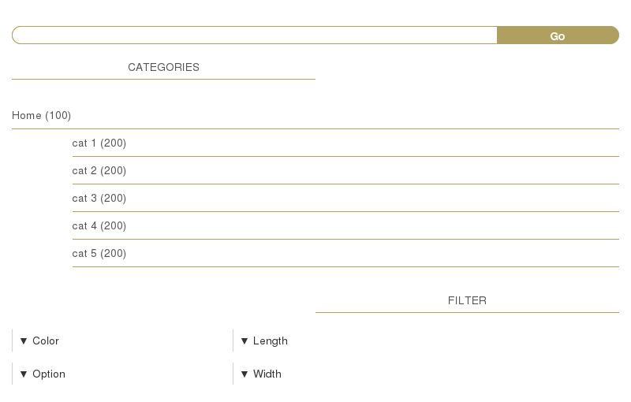
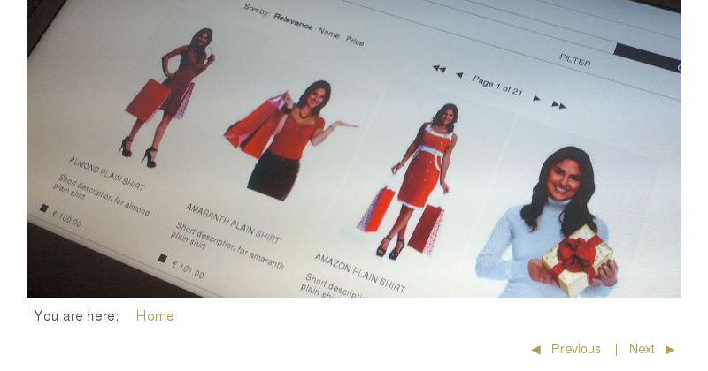
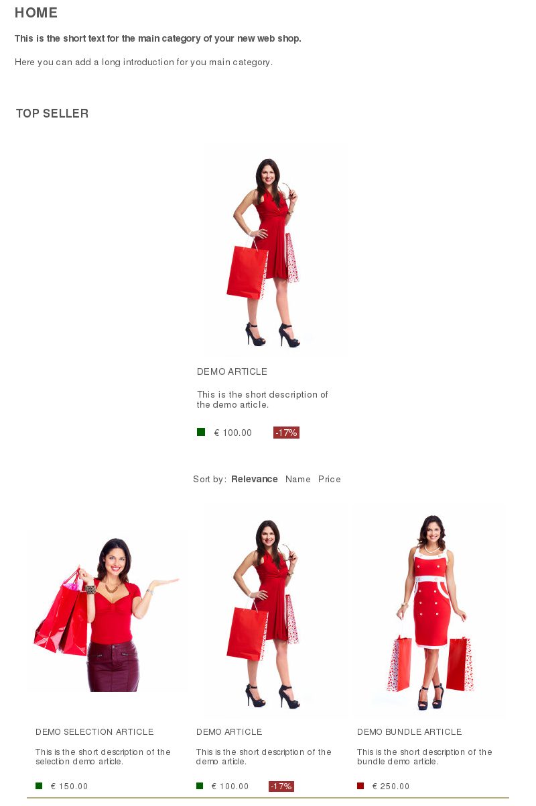
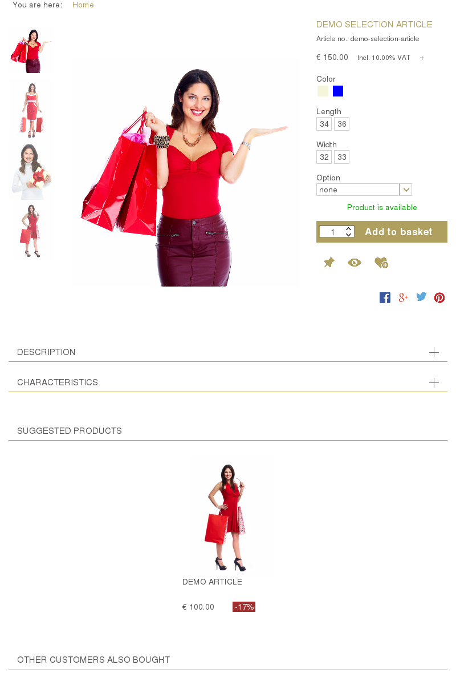
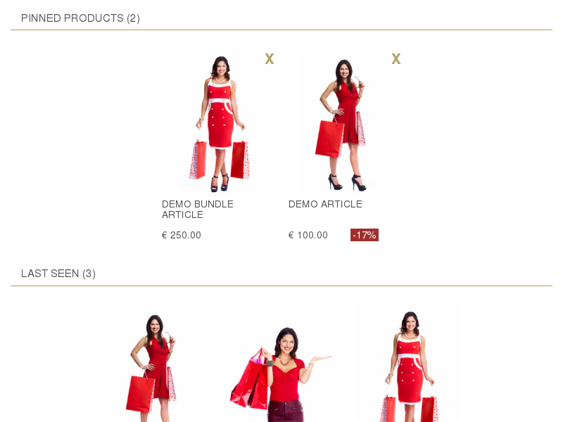
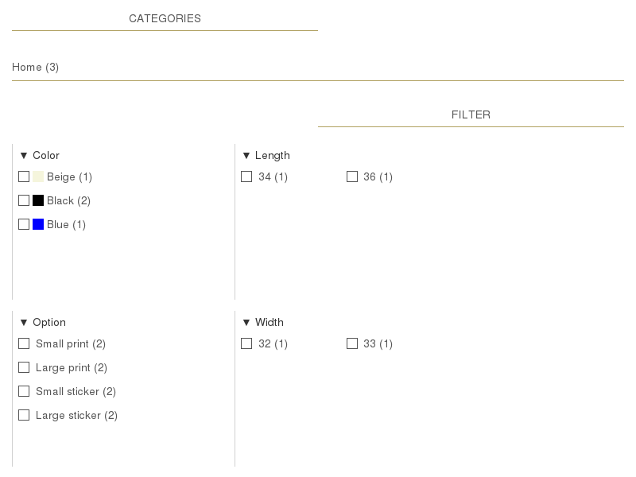
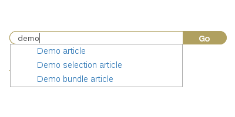
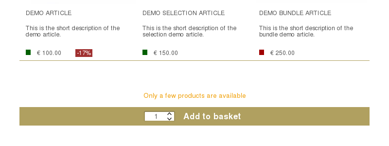

# Filter

When visitors are looking for products in the shop catalog, they need to utilize the catalog filter component. It offers possibilities to browse, search and filter products displayed in the Aimeos catalog list component.

## Structure



In the [filter component implementation](../../config/client-html/catalog-filter.md#name_1), at least three sections are available that can be controlled via the [filter subpart configuration](../../config/client-html/catalog-filter.md#subparts):

[attribute client](../../config/client-html/catalog-filter.md#name)
: the faceted search including the [attribute subpart](../../config/client-html/catalog-filter.md#standardsubparts)

[price client](../../config/client-html/catalog-filter.md#name_2)
: price filter including the [price subpart](../../config/client-html/catalog-filter.md#standardsubparts_1)

[search client](../../config/client-html/catalog-filter.md#name_3)
: full text search including the [search subpart](../../config/client-html/catalog-filter.md#standardsubparts_2)

[supplier client](../../config/client-html/catalog-filter.md#name_4)
: list of suppliers including the [supplier subpart](../../config/client-html/catalog-filter.md#standardsubparts_3)

[tree client](../../config/client-html/catalog-filter.md#name_5)
: category tree including the [tree subpart](../../config/client-html/catalog-filter.md#standardsubparts_4)

The catalog filter component itself has an additional [configuration option for the search button](../../config/client-html/catalog-filter.md#button) that is normally displayed below the filter if Javascript is disabled. Via this setting, you can control if the button will be rendered or not.

For the tree subpart there are a few more options available, and they influence how the catalog tree is displayed:

[controller/frontend/catalog/levels-always](../../config/controller-frontend/catalog.md#levels-always)
: Number of category levels that are always displayed

[controller/frontend/catalog/levels-only](../../config/controller-frontend/catalog.md#levels-only)
: No more than this number of category levels will be visible

[client/html/catalog/filter/tree/startid](../../config/client-html/catalog-filter.md#startid)
: Category ID to start with instead of the root category

## Templates

You can adapt the templates for the catalog filter component and their subparts by overwriting the templates in your extension or configuring alternative template names:

* [template body for the filter component](../../config/client-html/catalog-filter.md#template-body)
* [template header for the filter component](../../config/client-html/catalog-filter.md#template-header)
* [template body for the attribute filter](../../config/client-html/catalog-filter.md#standardtemplate-body)
* [template body for the price filter](../../config/client-html/catalog-filter.md#standardtemplate-body_1)
* [template body for the search filter](../../config/client-html/catalog-filter.md#standardtemplate-body_2)
* [template body for the supplier filter](../../config/client-html/catalog-filter.md#standardtemplate-body_3)
* [template body for the category tree](../../config/client-html/catalog-filter.md#standardtemplate-body_4)

If you want to change the HTML structure of one of the templates, please have a look at the original versions to ensure that you don't loose essential functionality.

# Stage

Usually, the catalog stage component is placed over the product list and detail components. It can display category specific images and give users the ability to navigate between products and return to their previous product list.

## Structure



In the [stage component implementation](../../config/client-html/catalog-stage.md#name), one additional section is available that can be controlled via the [stage subpart configuration](../../config/client-html/catalog-stage.md#subparts):

[navigator client](../../config/client-html/catalog-stage.md#name_1)
: back/next product links inluding the [navigator subpart](../../config/client-html/catalog-stage.md#standardsubparts)

Furthermore, you can limit or extend the domain items that are fetched from the database and thus available in the templates via the [client/html/catalog/stage/standard/domains](../../config/client-html/catalog-stage.md#domains) setting.

## Templates

You can adapt the templates for the catalog stage component and their subparts by overwriting the templates in you own extension or configuring alternative template names:

* [template body for the stage component](../../config/client-html/catalog-stage.md#template-body)
* [template header for the stage component](../../config/client-html/catalog-stage.md#template-header)
* [template body for the navigator](../../config/client-html/catalog-stage.md#standardtemplate-body)

If you want to change the HTML structure of one of the templates, please have a look at the original versions to ensure that you don't loose essential functionality.

# Lists

Product lists are the backbone of every web shop, because they show visitors which products are available. In Aimeos, product lists are far more powerful than that. They can contain much more information like category texts/images, quotes, category top sellers and so on.



The [list component implementation](../../config/client-html/catalog-lists.md#name_1) contains some settings that are used by more than one subpart:

[client/html/catalog/lists/catid-default](../../config/client-html/catalog-lists.md#catid-default)
: If there's no category ID in the given parameters, this one is used to display products and the category information

[client/html/catalog/lists/domains](../../config/client-html/catalog-lists.md#domains)
: A list of domain names whose items should be available in the product list view template. To add additional category or supplier data, use something like this:
```
['text', 'media', 'price', 'catalog' => ['text', 'media'], 'supplier' => ['text']]
```
For details please have a look at the documentation of the [*get()* manager method](../../infrastructure/managing-items.md#get-item)

[client/html/catalog/lists/size](../../config/client-html/catalog-lists.md#size_1)
: The maximum number of products shown in a list page before the result is paginated

[client/html/catalog/lists/stock/enable](../../config/client-html/catalog-lists.md#enable_1)
: Enables or disables displaying product stock levels in product list views

Other components such as the catalog filter need to know at which URL the product list will be displayed. The generated URL can be configured by these settings:

* [URL target, e.g. page or route](../../config/client-html/catalog-lists.md#target)
* [Controller name](../../config/client-html/catalog-lists.md#controller)
* [Controller action](../../config/client-html/catalog-lists.md#action)
* [URL settings, e.g. for absolute URLs](../../config/client-html/catalog-lists.md#config)

Used templates for the list component are:

* [template body](../../config/client-html/catalog-lists.md#template-body)
* [template header](../../config/client-html/catalog-lists.md#template-header)

To those templates additional data like category information (texts, images), customer quotes (texts) is assigned. Store owners can attach these texts and images to categories that describe what products are listed in those categories and provide images as visual elements for that description.

The body template also uses a partial for rendering the pagination which contains not only the links for the product list paging itself but also the possibilities for sorting the result set.

Furthermore, the list component consists of two subparts that can be controlled by the [list subparts configuration](../../config/client-html/catalog-lists.md#subparts). These are described in more detail below.

## Main product list

In the section implementing the [product item list](../../config/client-html/catalog-lists.md#name_1), the found products are displayed taking the given parameter and configuration settings into account. More subparts can be added via the [list subparts](../../config/client-html/catalog-lists.md#subparts) setting. The items section use the options named in the list component description to configure the output of the product list.

Used template in the list items section is:

* [template body](../../config/client-html/catalog-lists.md#standardtemplate-body)

## Promotional products

Besides associating products as regular ones to categories, they can also be added as products that should be promoted. The difference is only the list type of the associated items. These products are then displayed in a special "top seller" section, which is provided by the [promo section implementation](../../config/client-html/catalog-lists.md#name_2).

It's a short product list usually displayed on top of the list of regular products and if more features are necessary, they can be implemented by further subparts controlled by the [promo subparts](../../config/client-html/catalog-lists.md#standardsubparts_1) setting.

The promotional subpart itself can be additionally configured by the [client/html/catalog/lists/promo/size](../../config/client-html/catalog-lists.md#size) option, that limits the number of promotional products displayed.

Used template in the promotional list section is:

* [template body](../../config/client-html/catalog-lists.md#standardtemplate-body_1)

# Detail

The most important part of every web shop is the product detail page. It should inform the visitors about the product and convince them to buy it. The detail component of Aimeos consists of a whole bunch of sections that provide various types of information about the product which are described in this article.



In the [detail component implementation](../../config/client-html/catalog-detail.md#name) there's a configuration option that is used by several subparts:

[client/html/catalog/detail/domains](../../config/client-html/catalog-detail.md#domains)
: A list of domain names whose items should be available in the product detail view template. To add additional category or supplier data, use something like this:
```
['text', 'media', 'price', 'catalog' => ['text'], 'supplier' => ['text', 'media']]
```
For details please have a look at the documentation of the [*get()* manager method](../../infrastructure/managing-items.md#get-item)

Other components such as the catalog list need to know at which URL the product details will be displayed. The generated URL can be configured via these settings:

* [URL target, e.g. page or route](../../config/client-html/catalog-detail.md#target)
* [Controller name](../../config/client-html/catalog-detail.md#controller)
* [Controller action](../../config/client-html/catalog-detail.md#action)
* [URL settings, e.g. for absolute URLs](../../config/client-html/catalog-detail.md#config)

Used templates for the detail component are:

* [template body](../../config/client-html/catalog-detail.md#template-body)
* [template header](../../config/client-html/catalog-detail.md#template-header)

Furthermore, the detail component consists of two subparts (service and last seen) that can be controlled via the [detail subpart configuration](../../config/client-html/catalog-detail.md#subparts). These are described in more detail below.

The image section displays the product's images and provides features such as a thumbnail list of all images and a light box, allowing the user to zoom-in and toggle the photo to full screen. This is implemented as a partial that is included in the body template.

Inside the basket related section is all the necessary information for choosing the product that is displayed and the required hidden data for adding the product to the basket. It's also responsible for displaying the price of the product (or of the selected sub-product) and the [stock level information](../../config/client-html/catalog-detail.md#enable) too. The selection of the product variant and optional attributes is outsourced in reusable partials.

!!! note
    The parameters and their format to add a product into the basket is described in the [parameters section of the basket standard component](parameter-names.md#basket)

How customers can select the attributes for both types can be configured with the

```
client/html/catalog/selection/type/... = select|radio
```
and
```
client/html/catalog/attribute/type/... = select|input
```

configuration options. You only have to replace the three dots (...) with the attribute code used for the attribute types (length, width, color, size, etc.). Using "select" will display a HTML select box while "radio" will show a HTML radio checkbox for each option. The value "select" is the default for all attribute types if nothing else is configured.

You can also enforce if there's an option pre-selected or not using:
```
client/html/catalog/selection/preselect/... = 1
client/html/catalog/attribute/preselect/... = 1
```

## Services

The delivery option listing is implemented as subpart because it has to fetch additional, non-product related information from the database. More [service subparts](../../config/client-html/catalog-detail.md#standardsubparts_1) can be added to the [service implementation](../../config/client-html/catalog-detail.md#name_2) if necessary.

Only the body template is used by the service section:

* [template body](../../config/client-html/catalog-detail.md#standardtemplate-body_1)

## Bundled products

If the shown product is of type "bundle", the bundled products are displayed as well. For this, the product partial is used.

## User actions

The user actions are links to features where customers can add a product to one of their lists of pinned, favorite or watched products. Which user actions are shown is controlled by the [client/html/catalog/actions/list](../../config/client-html/catalog-actions.md#list) setting. They, as well as the social media buttons are both included by using partials.

There are several social platforms that can help to boost the sales of web shops, namely Pinterest, Facebook, WhatsApp and Twitter. They enable visitors to add products to their time line or social media profile.

Via the configuration option for the displayed [list of social links](../../config/client-html/catalog-social.md#list), you can choose which ones are available for your visitors. You can also add new social media links without changing the code. With the social list setting it's possible to add new or remove existing social links, which are then defined by the

```
client/html/catalog/social/url/... = https://...
```

settings. Replace the three dots (...) by the name you've used in the social list configuration and insert the link for sharing your product links as value. Links to these social media platforms are available by default:

* [client/html/catalog/social/url/facebook](../../config/client-html/catalog-social.md#facebook): Facebook
* [client/html/catalog/social/url/pinterest](../../config/client-html/catalog-social.md#pinterest): Pinterest
* [client/html/catalog/social/url/twitter](../../config/client-html/catalog-social.md#twitter): Twitter
* [client/html/catalog/social/url/whatsapp](../../config/client-html/catalog-social.md#whatsapp): WhatsApp

## Additional information

Another big block in the catalog detail component is the additional content. Here you can add all product content you might show your visitors for your products. This contains:

* Any text information about the product
* Shared product attributes like color or size
* Non-shared product properties like weight or dimensions
* Product related documents to download, e.g. reference manuals

The difference between product attributes and properties is in the way they are managed. Product attributes are shared and can be associated to many products while properties are only stored for one product. If you change an attribute, all products referencing the same will show the new content immediately while for properties this isn't the case.

## Suggested products

For each product, shop owners can offer a list of suggested products that are shown in their own section,. It can contain an arbitrary number of products (if zero, the section won't be displayed) but should only contain the few most important ones.

## Bought by others

When the job controller for generating the list of products bought together with the one displayed in the detail view runs regularly, this section will contain the appropriate products.

## Last seen products

This part is a bit special because it generates no visible output in the detail view. Instead, it creates the HTML for the last seen product that is added to the session of the visitor. It's all done by the [seen section implementation](../../config/client-html/catalog-detail.md#name_1) and even here, more data sections can be added by the [seen subparts](../../config/client-html/catalog-detail.md#standardsubparts) setting.

Like in the list or details component you also have the possibility to define which [domain items for the list of last seen products](../../config/client-html/catalog-detail.md#domains_1) (e.g. texts, media, prices, etc.) are fetched from the database.

Only the body template is used by the "last seen" section:

* [template body](../../config/client-html/catalog-detail.md#standardtemplate-body)

# Session

When visitors had a look at product details or if they pinned a product, this information is stored in the session of the visitor. The catalog session component displays this information and in the case of pinned products, visitors are also able to manage them.

## Structure



Two sections are part of the [catalog session component implementation](../../config/client-html/catalog-session.md#name) which can be controlled via the [session subpart configuration](../../config/client-html/catalog-session.md#subparts):

[pinned client](../../config/client-html/catalog-session.md#name_1)
: pinned products including the [pinned subpart](../../config/client-html/catalog-session.md#standardsubparts)

[seen client](../../config/client-html/catalog-session.md#name_2)
: the last seen products including the [seen subpart](../../config/client-html/catalog-session.md#standardsubparts_1)

Both subparts allow further configuration, namely for the entry count in the header and the maximum number of allowed items in both lists:

[client/html/catalog/session/pinned/domains](../../config/client-html/catalog-session.md#domains)
: A list of domains whose items should be fetched from the database for the product representation in the pinned view

[client/html/catalog/session/pinned/count/enable](../../config/client-html/catalog-session.md#countenable)
: Display the number of entries in the "pinned" list next to the section header

[client/html/catalog/session/pinned/standard/maxitems](../../config/client-html/catalog-session.md#standardmaxitems)
: Maximum number of displayed pinned products

[client/html/catalog/session/seen/count/enable](../../config/client-html/catalog-session.md#countenable_1)
: Display the number of entries in the "last seen" list next to the section header

[client/html/catalog/session/seen/standard/maxitems](../../config/client-html/catalog-session.md#standardmaxitems_1)
: Maximum number of displayed "last seen" products

## Templates

You can adapt the templates for the catalog filter component and their subparts by overwriting the templates in your own extension or configuring alternative template names:

* [template body for the session component](../../config/client-html/catalog-session.md#template-body)
* [template header for the session component](../../config/client-html/catalog-session.md#template-header)
* [template body for the pinned products list](../../config/client-html/catalog-session.md#standardtemplate-body)
* [template body for the "last seen" products list](../../config/client-html/catalog-session.md#standardtemplate-body_1)

If you want to change the HTML structure of one of the templates, please have a look at the original versions to ensure that you don't loose essential functionality.

# Count

For the faceted search, the product counts should be displayed right to the categories and filter attributes. These numbers are returned by a separate request and inserted into the page by the delivered Javascript code.

## Structure



The [catalog count component implementation](../../config/client-html/catalog-count.md#name_1) contains at least two sections that can be controlled via the [count subpart configuration](../../config/client-html/catalog-count.md#subparts):

[attribute client](../../config/client-html/catalog-count.md#name)
: attribute based faceted search including the [attribute subpart](../../config/client-html/catalog-count.md#standardsubparts)

[supplier client](../../config/client-html/catalog-count.md#name_2)
: supplier numbers including the [supplier subpart](../../config/client-html/catalog-count.md#standardsubparts_1)

[tree client](../../config/client-html/catalog-count.md#name_3)
: category numbers including the [tree subpart](../../config/client-html/catalog-count.md#standardsubparts_2)

In the catalog count component itself you can configure if the numbers should be calculated at all and how many products should be considered for calculation:

[client/html/catalog/count/enable](../../config/client-html/catalog-count.md#enable)
: Enables or disables displaying product counts in the catalog filter

[client/html/catalog/count/limit](../../config/client-html/catalog-count.md#limit)
: Limits the number of records that are used for product counts in the catalog filter

Additionally, the attribute and tree subparts can be configured separately to show the product counts or not:

[client/html/catalog/count/attribute/aggregate](../../config/client-html/catalog-count.md#aggregate)
: Enables or disables generating product counts for the attribute catalog filter

[client/html/catalog/count/supplier/aggregate](../../config/client-html/catalog-count.md#aggregate_1)
: Enables or disables generating product counts for the supplier catalog filter

[client/html/catalog/count/tree/aggregate](../../config/client-html/catalog-count.md#aggregate_2)
: Enables or disables generating product counts for the category catalog filter

To load the product counts, the URL of the catalog count component must be known and required URL is generated based on these settings:

* [URL target, e.g. page or route](../../config/client-html/catalog-count.md#target)
* [Controller name](../../config/client-html/catalog-count.md#controller)
* [Controller action](../../config/client-html/catalog-count.md#action)
* [URL settings, e.g. for absolute URLs](../../config/client-html/catalog-count.md#config)

## Templates

You can adapt the templates for the catalog filter component and their subparts by overwriting the templates in your own extension or configuring alternative template names:

* [template body for the count component](../../config/client-html/catalog-count.md#template-body)
* [template header for the count component](../../config/client-html/catalog-count.md#template-header)
* [template body for the attribute counts](../../config/client-html/catalog-count.md#standardtemplate-body)
* [template body for the supplier counts](../../config/client-html/catalog-count.md#standardtemplate-body_1)
* [template body for the category counts](../../config/client-html/catalog-count.md#standardtemplate-body_2)

If you want to change the HTML structure of one of the templates, please have a look at the original versions to ensure that you don't loose essential functionality.

# Suggest

When visitors use the catalog search filter to find products via a full text search, a list of product names is displayed whose content contains the entered words. This is also known as "auto completion" or "suggestion".

## Structure



The [suggest component implementation](../../config/client-html/catalog-suggest.md#name) consists only of the component itself, but you can add additional section via the [suggest subpart configuration](../../config/client-html/catalog-suggest.md#subparts).

To display the list of suggestions, the URL for fetching the found product names must be available. The generated URL can be configured via these settings:

* [URL target, e.g. page or route](../../config/client-html/catalog-suggest.md#target)
* [Controller name](../../config/client-html/catalog-suggest.md#controller)
* [Controller action](../../config/client-html/catalog-suggest.md#action)
* [URL settings, e.g. for absolute URLs](../../config/client-html/catalog-suggest.md#config)

## Templates

You can adapt the templates for the catalog suggest component by overwriting the templates in your own extension or configuring alternative template names:

* [catalog suggest body](../../config/client-html/catalog-suggest.md#template-body)
* [catalog suggest header](../../config/client-html/catalog-suggest.md#template-header)

If you want to change the HTML structure of one of the templates, please have a look at the original versions to ensure that you don't loose essential functionality.

# Stock

All product stock related information is fetched separately and added via Javascript into the product list and detail pages. The implementation also supports multiple stock level information (levels and descriptions) as well as multiple warehouses.

## Structure



The [stock component implementation](../../config/client-html/catalog-stock.md#name) consists only of the component itself, but you can add additional section via the [stock subpart configuration](../../config/client-html/catalog-stock.md#subparts).

Two additional settings allow control over details of the returned stock level information:

[client/html/catalog/stock/level/low](../../config/client-html/catalog-stock.md#low)
: Number of products which a stock level below is considered as "low"

[client/html/catalog/stock/sort](../../config/client-html/catalog-stock.md#sort)
: Sort key if stock levels for multiple warehouses exist to get a consistent sorting


While loading the product list and details views, the URL for fetching the stock level information must be available. The generated URL can be configured via these settings:

* [URL target, e.g. page or route](../../config/client-html/catalog-stock.md#target)
* [Controller name](../../config/client-html/catalog-stock.md#controller)
* [Controller action](../../config/client-html/catalog-stock.md#action)
* [URL settings, e.g. for absolute URLs](../../config/client-html/catalog-stock.md#config)

## Templates

You can adapt the templates for the catalog stock component by overwriting the templates in your own extension or configuring alternative template names:

* [catalog stock body](../../config/client-html/catalog-stock.md#template-body)
* [catalog stock header](../../config/client-html/catalog-stock.md#template-header)

If you want to change the HTML structure of one of the templates, please have a look at the original versions to ensure that you don't loose essential functionality.
